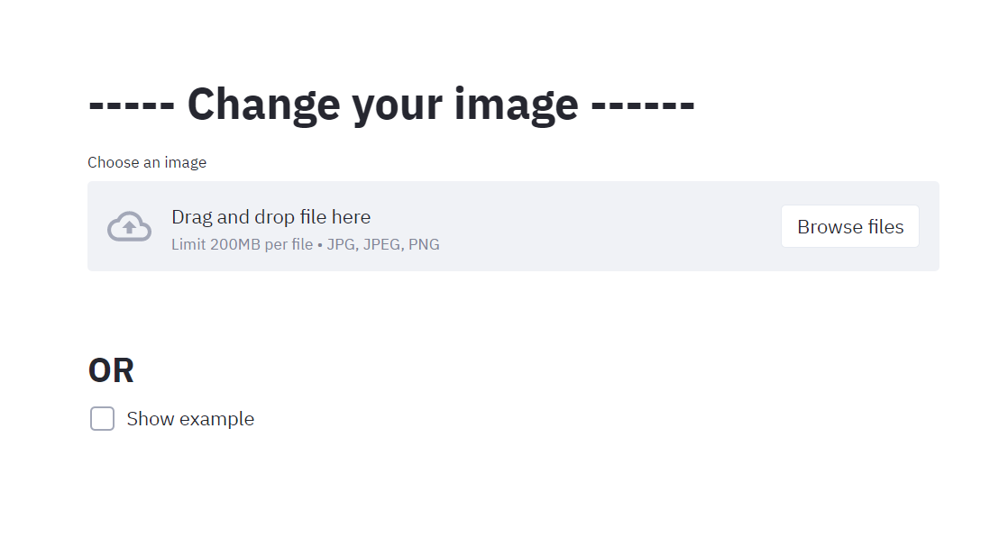

# Browser Image Filter


## Wow! version 0.0.2 is available!!
## Features of 0.0.2:
1. Added two new filters for images


2. That's all for now))

## How to use this project?
1. **Download** the repository
2. **Download** libraries from **requirments.txt**
3. Open your **cmd** and enter path to **browser_image_main.py**
4. Enter ```streamlit run browser_image_main.py``` in your **cmd**
5. Your default browser will open and you'll see something like this

6. Now you can upload your image or see an example of how the project works by clicking *'Show example'* **button**

7. After that, in the window that appears, you can select the type of changes


# Versions
1. **v.0.0.1** (15.01.2021) 
2. **v.0.0.2** (16.01.2021)
